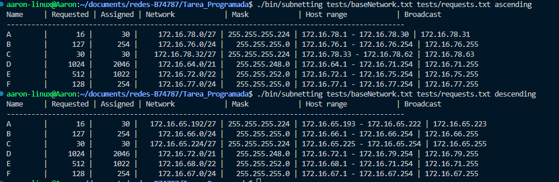

# Instrucciones de compilación y ejecución

## Compilación

Para compilar el programa, se debe abrir la carpeta Tarea_Programada en terminal. Posteriromente se deben ejecutar los comandos:

    make clean
    make

## Ejecución

Para ejecutar el programa, se debe ejecutar con 2 parametros, siendo el primero el nombre del archivo con la red que se desea subnetear y el segundo el con el nombre del archivo con las solicitudes. En la carpeta test se brindan archivos de prueba. El comando que se debe ejecutar para subneteo ascendente es:

    ./bin/subnetting tests/baseNetwork.txt tests/requests.txt ascending

Y para subneteo descendente:

    ./bin/subnetting tests/baseNetwork.txt tests/requests.txt descending

# Ejemplo de la salida
- Archivo con red base: baseNetwork.txt
- Archivo con solicitudes: requests.txt
